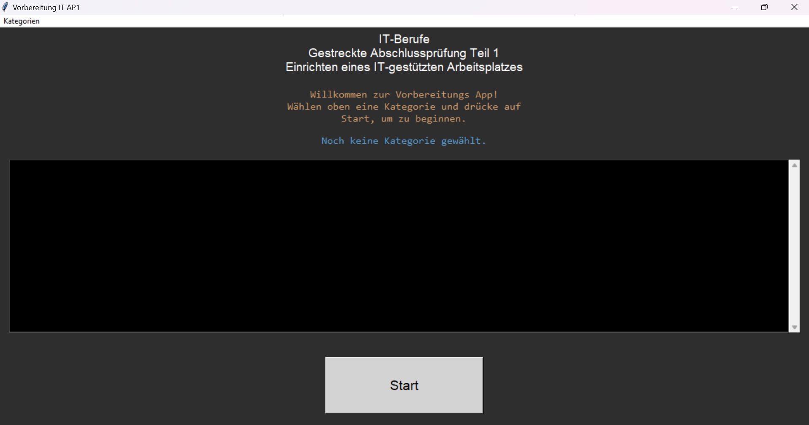
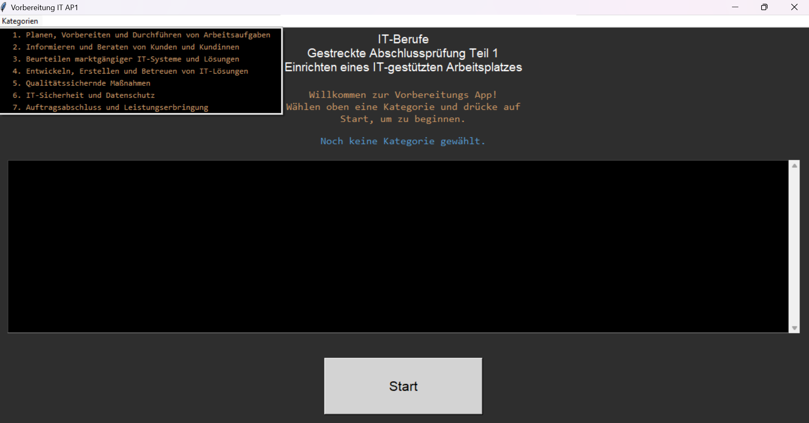
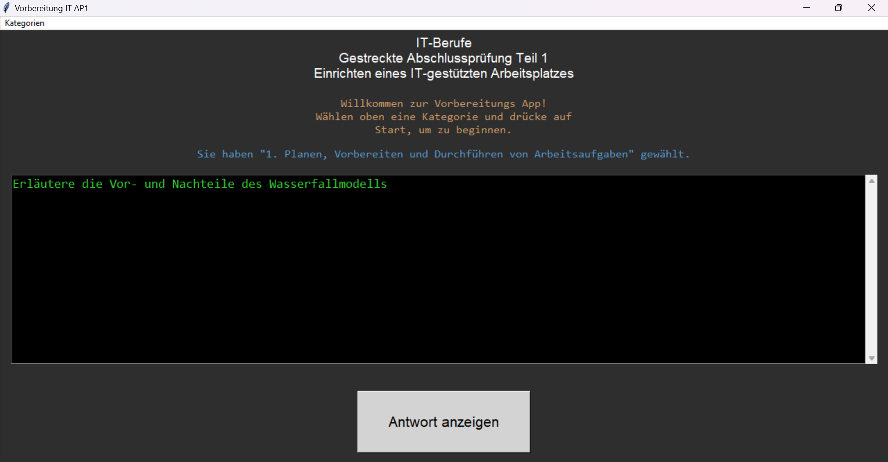
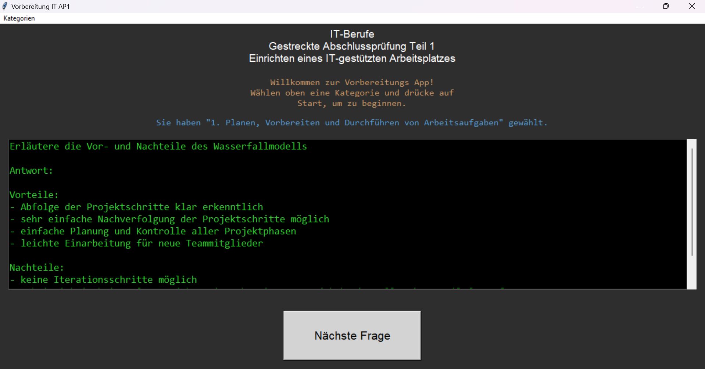

# AP1-Prüfungsvorbereitung für die IHK

Dieses Projekt ist eine interaktive Anwendung, die speziell für die Vorbereitung auf die IHK-Abschlussprüfung Teil 1 (AP1) entwickelt wurde. Die Anwendung basiert auf den offiziellen IHK-Prüfungskärtchen und dient dazu, das Wissen zu verschiedenen Prüfungsthemen effektiv und strukturiert zu vertiefen.

## Features
- **Themenauswahl:** Wähle aus verschiedenen IHK-relevanten Themenfeldern wie "Planen, Vorbereiten und Durchführen von Arbeitsaufgaben" oder "IT-Sicherheit und Datenschutz".
- **Fragen und Antworten:** Die Anwendung zeigt Fragen nacheinander an, und die Antworten können durch einen Klick auf "Antwort anzeigen" sichtbar gemacht werden.
- **Benutzerfreundlichkeit:** Einfach zu bedienen und ideal zur Vorbereitung auf die AP1-Prüfung.
- **In Bearbeitung:** Dieses Projekt wird kontinuierlich weiterentwickelt und verbessert.

## Themenfelder
Die Anwendung deckt die folgenden IHK-Prüfungsthemen ab:

1. **Planen, Vorbereiten und Durchführen von Arbeitsaufgaben**
   - Projektmanagement (Netzplan, Gantt-Diagramm, Meilenstein-Planung, etc.)
   - Top-Down- und Bottom-Up-Ansätze
   - Kommunikations- und Teamprozesse (Forming, Storming, Norming, Performing)
   - Risikoanalysen und Machbarkeitsstudien

2. **Informieren und Beraten von Kunden und Kundinnen**
   - Kundenkommunikation und Beratung
   - Verständnis volkswirtschaftlicher Sektoren

3. **Beurteilen marktgängiger IT-Systeme und Lösungen**
   - Analyse und Vergleich von IT-Systemen

4. **Entwickeln, Erstellen und Betreuen von IT-Lösungen**
   - Erstellung und Betreuung individueller IT-Lösungen

5. **Qualitätssichernde Maßnahmen**
   - Implementierung und Kontrolle von Qualitätssicherungsprozessen

6. **IT-Sicherheit und Datenschutz**
   - Maßnahmen zur Datensicherheit und Einhaltung von Datenschutzrichtlinien

7. **Auftragsabschluss und Leistungserbringung**
   - Durchführung von Abschlussmaßnahmen und Kundenbetreuung

## Hinweis zu den Fragen
Die Fragen und Antworten basieren auf den IHK-Prüfungskärtchen und sind urheberrechtlich geschützt. Sie dürfen weder veröffentlicht noch außerhalb dieser Anwendung verbreitet werden. Die Inhalte dienen ausschließlich zur persönlichen Prüfungsvorbereitung.

## Installation
1. **Repository klonen:**
   ```bash
   git clone <repository-url>
   ```
2. **Abhängigkeiten installieren:**
   Python 3.x ist erforderlich. Es werden keine zusätzlichen externen Bibliotheken benötigt.

3. **Dateistruktur sicherstellen:**
   Stelle sicher, dass die Dateien `fragen.py` und `main.py` im selben Verzeichnis liegen.

4. **Anwendung starten:**
   ```bash
   python main.py
   ```

## Verwendete Technologien
- **Programmiersprache:** Python
- **GUI:** Tkinter für die Benutzeroberfläche

## Lizenz
Das Projekt selbst ist nicht urheberrechtlich geschützt. Der Fragenpool basiert jedoch auf den IHK-Prüfungskärtchen und ist urheberrechtlich geschützt. Die Fragen dürfen nicht ohne Genehmigung weiterverbreitet werden bzw. wurden ignoriert, ich stelle nur die Struktur der Fragen hier online damit man diese bei Bedarf selbst anlegen kann...

## Kontakt
Für Rückfragen oder weitere Informationen besuche bitte dein GitHub-Profil oder kontaktiere den Projektbetreuer.

## Impressionen
Start:


Kategorien bzw. Themenfelder:


Fragen:


Antwort:
